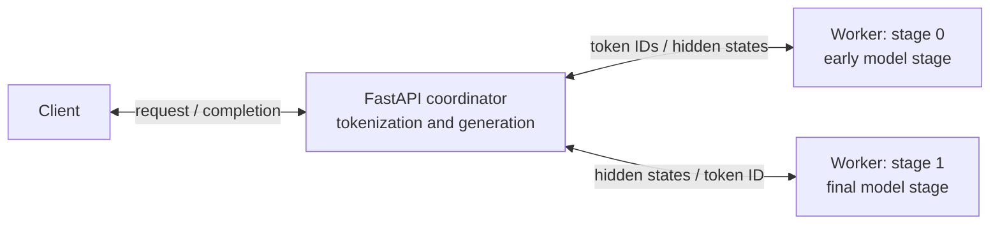

# everygpu

> Turn GPUs scattered across different devices into one LLM inference service.

Current release: **0.0.1** · [Architecture changelog](CHANGELOG.md)

everygpu is an experimental runtime for distributed autoregressive transformer inference across heterogeneous, independently hosted devices. Its technical bet is that model-aware partitioning and topology-aware scheduling can make GPUs with different VRAM capacities, compute throughput, network links and availability behave as one logical inference service, even when no device can hold the complete model.

Clients submit requests to one endpoint. A control plane should inventory workers, profile their hardware and links, and place layers, experts, weights and KV-cache state. A data plane should move token IDs, activations and cache state along the selected execution path. The runtime, rather than the client, should own device selection, shard placement and request routing.

## What exists today

Version `0.0.1` fixes the execution plan to one causal language model split across exactly two long-lived workers. A FastAPI coordinator owns tokenization, serializes generation with an `asyncio.Lock` and maintains the growing token sequence. Each worker loads a role-specific safetensors checkpoint and executes one contiguous range of transformer layers.

For every generated token:

1. The coordinator sends the full token sequence to stage 0 as JSON over a WebSocket.
2. Stage 0 runs token embedding and the early transformer layers with `use_cache=False`, moves the resulting hidden states to CPU and serializes them as a safetensors binary payload.
3. The coordinator forwards that payload to stage 1.
4. Stage 1 moves the hidden states to its device, runs the remaining layers, final normalization and language-model head, then returns the greedy `argmax` token ID as JSON.

OpenTelemetry records coordinator, transport and worker measurements. Tempo stores the traces, and the Streamlit profiler derives request latency, time to first token, per-token latency, GPU execution time, process time, payload size and reserved GPU memory from them.

## Current architecture

## Measured results

| Trace | Prompt tokens | E2E | TTFT | TPOT | Throughput | GPU execution | Measured transport |
| --- | ---: | ---: | ---: | ---: | ---: | ---: | ---: |
| `d6f15f27` | 2 | 9.000 s | 343.1 ms | 455.6 ms | 2.22 tok/s | 5.345 s (59.4%) | 3.631 s (40.3%) |
| `21b03c21` | 27 | 12.136 s | 589.0 ms | 607.7 ms | 1.65 tok/s | 6.476 s (53.4%) | 5.634 s (46.4%) |
| `2d425d30` | 228 | 15.749 s | 989.8 ms | 776.8 ms | 1.27 tok/s | 6.949 s (44.1%) | 8.761 s (55.6%) |

These diagnostic traces, not standardized benchmarks, show measured transport rising from 40.3% to 55.6% of end-to-end latency as full-sequence hidden-state payloads grow without a KV cache.

## Current constraints

- The execution graph is a fixed, sequential two-stage pipeline; connection order determines placement.
- A coordinator-wide lock permits one active completion at a time. There is no batching or concurrent scheduling.
- Generation is greedy and capped at 20 new tokens.
- There is no KV cache. Every decode step recomputes the complete sequence.
- Hidden states travel through coordinator memory; there is no worker-to-worker transport, activation compression or overlap of communication and compute.
- There is no capability discovery, dynamic placement, replication, migration or failover.
- The endpoint has no authentication, TLS, streaming or full OpenAI API compatibility.

This is an experimental system. Do not expose port `8765` to an untrusted network.
